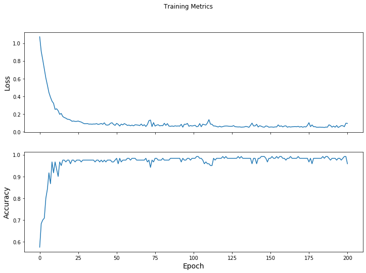
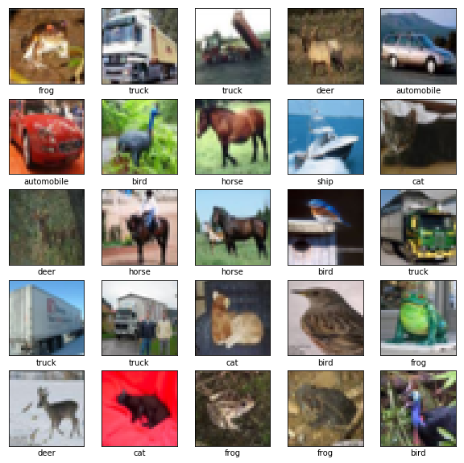
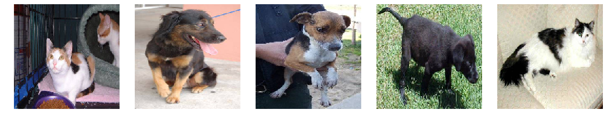
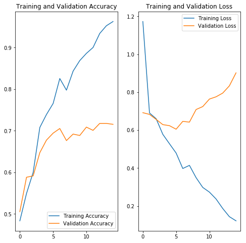
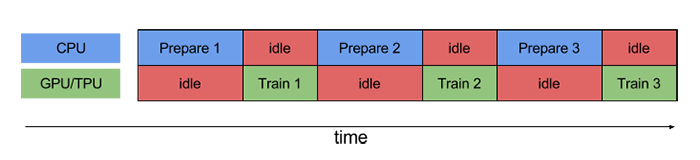
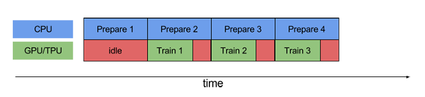
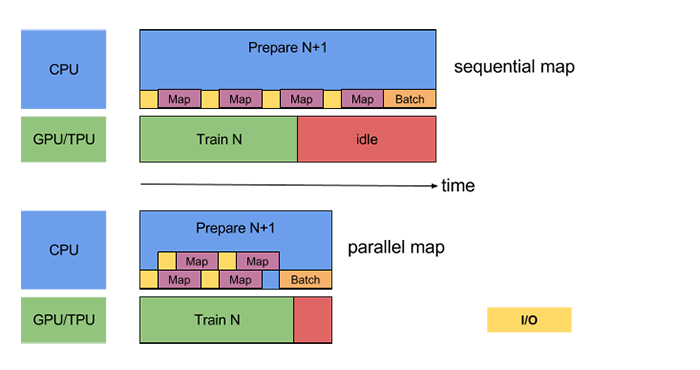
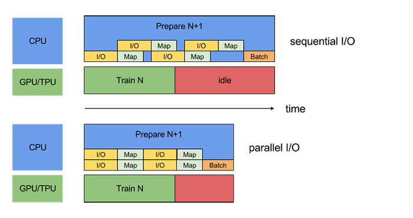

# Tensorflow 2.0
# Load and Import Data
## Create Dataset
### Dataset from file or url
```python
train_dataset_url = "https://storage.googleapis.com/download.tensorflow.org/data/iris_training.csv"

train_dataset_fp = tf.keras.utils.get_file(fname=os.path.basename(train_dataset_url), origin=train_dataset_url)
column_names = ['sepal_length', 'sepal_width', 'petal_length', 'petal_width', 'species']

feature_names = column_names[:-1]
label_name = column_names[-1]
batch_size = 32

train_dataset = tf.data.experimental.make_csv_dataset(
    train_dataset_fp,
    batch_size,
    column_names=column_names,
    label_name=label_name,
    num_epochs=1)
```
### Create CSV Dataset
After creating a dataset like the last section method, we need to make an iterable dataset. Use the following method to achieve this goal:
```python
batch_size = 32

train_dataset = tf.data.experimental.make_csv_dataset(
    train_dataset_fp,
    batch_size,
    column_names=column_names,
    label_name=label_name,
    num_epochs=1)

```
## Get The Correct Number Of Columns
To change the shape of dataset into [n_batched, n_features]:
```python
def pack_features_vector(features, labels):
  """Pack the features into a single array."""
  features = tf.stack(list(features.values()), axis=1)
  return features, labels

train_dataset = train_dataset.map(pack_features_vector)
```
## Working with tensorflow_datasets
```python
import tensorflow_datasets as tfds
tfds.disable_progress_bar()
SPLIT_WEIGHTS = (8, 1, 1)
splits = tfds.Split.TRAIN.subsplit(weighted=SPLIT_WEIGHTS)

(raw_train, raw_validation, raw_test), metadata = tfds.load(
    'cats_vs_dogs', split=list(splits),
    with_info=True, as_supervised=True)
get_label_name = metadata.features['label'].int2str
```
## Tricks
Use the following to shuffle the iterator and output in BATCH_SIZE.
```python
train_batches = train.shuffle(SHUFFLE_BUFFER_SIZE).batch(BATCH_SIZE)
```

# Load And Preprocess Data
## One-hot
```python
tf.feature_column.indicator_column(tf.feature_column.categorical_column_with_vocabulary_list('class', ('First', 'Second', 'Third')))
```
Or in another words:
```python
tf.feature_column.categorical_column_with_vocabulary_list(feature_name, vocab))
```
## Data Generator
```python
from tensorflow.keras.preprocessing.image import ImageDataGenerator
train_image_generator = ImageDataGenerator(rescale=1./255) # Generator for our training data
validation_image_generator = ImageDataGenerator(rescale=1./255) # Generator for our validation data
train_data_gen = train_image_generator.flow_from_directory(batch_size=batch_size, directory=train_dir,shuffle=True, target_size=(IMG_HEIGHT, IMG_WIDTH), class_mode='binary')
```
ImageDataGenerator augmentations include:
featurewise_center, samplewise_center, featurewise_std_normalization,samplewise_std_normalization, zca_epsilon, zca_whitening, rotation_range, width_shift_range, height_shift_range, brightness_range, shear_range, zoom_range, channel_shift_range,horizontal_flip,vertical_flip,preprocessing_function
Full list can be found at :[ImageDataGenerator](https://www.tensorflow.org/api_docs/python/tf/keras/preprocessing/image/ImageDataGenerator)
## Normalize Image
```python
def normalize(input_image, input_mask):
  input_image = tf.cast(input_image, tf.float32) / 255.0
  input_mask -= 1
  return input_image, input_mask
```
## Prelimineary Image Augmentation
Use [tf.image](https://www.tensorflow.org/api_docs/python/tf/image) module to change hue, size, crop, etc.  
## Create Text Dataset
### Download The Files
Fist we need to create a dataset with 'tensorflow_datasets':
```python
import tensorflow_datasets as tfds

DIRECTORY_URL = 'https://storage.googleapis.com/download.tensorflow.org/data/illiad/'
FILE_NAMES = ['cowper.txt', 'derby.txt', 'butler.txt']

for name in FILE_NAMES:
  text_dir = tf.keras.utils.get_file(name, DIRECTORY_URL+name)
parent_dir = os.path.dirname(text_dir)
```
### Load Into Dataset
Each dataset needs to be labeled(?)
```python
def labeler(example, index):
  return example, tf.cast(index, tf.int64)
labeled_datasets = []

for i, file_name in enumerate(FILE_NAMES):
  line_dataset = tf.data.TextLineDataset(os.path.join(parent_dir,file_name))
  labeled_dataset = line_dataset.map(lambda ex:labeler(ex,i))
  labeled_datasets.append(labeled_dataset)
```
Then we need to combine them into a single dataset.
```python
BUFFER_SIZE = 50000
BATCH_SIZE = 64
TAKE_SIZE = 5000

all_labeled_data=labeled_datasets[0]
for labeled_dataset in labeled_datasets[1:]:
  all_labeled_data.concatenate(labeled_dataset)

all_labeled_data= all_labeled_data.shuffle(BUFFER_SIZE, reshuffle_each_iteration = False)
```
At this stage you can use 'tf.data.Dataset.take() to see what's inside the tensor, eg:
```python
for ex in all_labeled_data.take(5):
  print(ex)
```
### Build Vocabulary
Use tokenizer to convert strings of words into unique integers.
```python
tokenizer = tfds.features.text.Tokenizer()
vocabulary_set=set()
for text_tensor, _ in all_labeled_data:
  some_token = tokenizer.tokenize(text_tensor.numpy())
  vocabulary_set.update(some_token)
```
### Encode Text
Now we need to encode our dataset. 'tf.features.text.TokenTextEncoder()' gets a vocabulary and creates an object which converts text tensor into list of integers.
```python
encoder = tf.features.text.TokenTextEncoder(vocabulary_set)

example_text = next(iter(all_labeled_data))[0].numpy()
encoded_example = encoder.encode(example_text)

def encode(text_tensor, label):
  encoded_text = encoder.encode(text_tensor.numpy)
  return encoded_text, label

def encode_map_fn(text, label):
  return tf.py_function(encode, inp=[text, label], Tout = (tf.int64, tf.int64))

all_encoded_data = all_labeled_data.map(encode_map_fn)
```
### Split The Data Into Train And Test
All the datas need to be the same length, but in this text we have varying sentence length. 
```python
train_data = all_encoded_data.skip(TAKE_SIZE).shuffle(BUFFER_SIZE)
train_data = train_data.padded_batch(BATCH_SIZE,padded_shape=([-1],[]))
```
## Data From Local And Remote Locations
Read image from remote server:
```python
content_path = tf.keras.utils.get_file('YellowLabradorLooking_new.jpg', 'https://storage.googleapis.com/download.tensorflow.org/example_images/YellowLabradorLooking_new.jpg')
```
Read image frome disk:
```python
img = tf.io.read_file(path_to_img)
  img = tf.image.decode_image(img, channels=3)
  img = tf.image.convert_image_dtype(img, tf.float32)
```
## Small Notes On Working With Data
Don't forger type casting:
```python
 shape = tf.cast(tf.shape(img)[:-1], tf.float32)
  long_dim = max(shape)
  scale = max_dim / long_dim

  new_shape = tf.cast(shape * scale, tf.int32)

  img = tf.image.resize(img, new_shape)
  img = img[tf.newaxis, :]
```
Images have 3 axis:
```python
if len(image.shape) > 3:
    image = tf.squeeze(image, axis=0)
```
# Create Model
## Custom Layers
### Expert Model
- Inheret from tf.keras.layers or tf.keras.model classes
#### Keras Layer
```python
class MyDenseLayer(tf.keras.layers.Layer):
    def __init__(self, num_outputs):
        super(MyDenseLayer, self).__init__()
        self.num_outputs = num_outputs

    def build(self, input_shape):
        self.kernel = self.add_variable("kernel",
                                        shape=[int(input_shape[-1]),
                                            self.num_outputs])

    def call(self, input):
        return tf.matmul(input, self.kernel)

    layer = MyDenseLayer(10)
```
#### Keras Model
- More robust. Has a concise summary
```python
class ResnetIdentityBlock(tf.keras.Model):
    def __init__(self, kernel_size, filters):
        super(ResnetIdentityBlock, self).__init__(name='')
        filters1, filters2, filters3 = filters

        self.conv2a = tf.keras.layers.Conv2D(filters1, (1, 1))
        self.bn2a = tf.keras.layers.BatchNormalization()

        self.conv2b = tf.keras.layers.Conv2D(filters2, kernel_size, padding='same')
        self.bn2b = tf.keras.layers.BatchNormalization()

        self.conv2c = tf.keras.layers.Conv2D(filters3, (1, 1))
        self.bn2c = tf.keras.layers.BatchNormalization()

    def call(self, input_tensor, training=False):
        x = self.conv2a(input_tensor)
        x = self.bn2a(x, training=training)
        x = tf.nn.relu(x)

        x = self.conv2b(x)
        x = self.bn2b(x, training=training)
        x = tf.nn.relu(x)

        x = self.conv2c(x)
        x = self.bn2c(x, training=training)

        x += input_tensor
        return tf.nn.relu(x)


    block = ResnetIdentityBlock(1, [1, 2, 3])
```
- Get block variables:
```python
len(block.variables)
```
- Get summary:
```python
block.summary()
```
Another example:
```python
class StyleContentModel(tf.keras.models.Model):
  def __init__(self, style_layers, content_layers):
    super(StyleContentModel, self).__init__()
    self.vgg =  vgg_layers(style_layers + content_layers)
    self.style_layers = style_layers
    self.content_layers = content_layers
    self.num_style_layers = len(style_layers)
    self.vgg.trainable = False

  def call(self, inputs):
    "Expects float input in [0,1]"
    inputs = inputs*255.0
    preprocessed_input = tf.keras.applications.vgg19.preprocess_input(inputs)
    outputs = self.vgg(preprocessed_input)
    style_outputs, content_outputs = (outputs[:self.num_style_layers], 
                                      outputs[self.num_style_layers:])

    style_outputs = [gram_matrix(style_output)
                     for style_output in style_outputs]

    content_dict = {content_name:value 
                    for content_name, value 
                    in zip(self.content_layers, content_outputs)}

    style_dict = {style_name:value
                  for style_name, value
                  in zip(self.style_layers, style_outputs)}
    
    return {'content':content_dict, 'style':style_dict}
extractor = StyleContentModel(style_layers, content_layers)

results = extractor(tf.constant(content_image))

style_results = results['style']
```
### Other Methods
#### Sequential
```python
my_seq = tf.keras.Sequential([tf.keras.layers.Conv2D(1, (1, 1),
                                        input_shape=(
                                            None, None, 3)),
                    tf.keras.layers.BatchNormalization(),
                    tf.keras.layers.Conv2D(2, 1,
                                        padding='same'),
                    tf.keras.layers.BatchNormalization(),
                    tf.keras.layers.Conv2D(3, (1, 1)),
                    tf.keras.layers.BatchNormalization()])
```
#### Custom Layer
Use lambda layer for experiment. For real application use 'tf.keras.layers.Layer'
```python
Lambda(lambda x: x ** 2)
```
## Load Pretrained Model
### Load From File

### Load From Keras
Tensorflow 2 has embedded keras classes. Use them to load pretrained models:
```python
x = tf.keras.applications.vgg19.preprocess_input(content_image*255)
x = tf.image.resize(x, (224, 224))
vgg = tf.keras.applications.VGG19(include_top=True, weights='imagenet')
prediction_probabilities = vgg(x)
prediction_probabilities.shape
predicted_top_5 = tf.keras.applications.vgg19.decode_predictions(prediction_probabilities.numpy())[0]
[(class_name, prob) for (number, class_name, prob) in predicted_top_5]
```
Then build the model:
```python
def vgg_layers(layer_names):
  """ Creates a vgg model that returns a list of intermediate output values."""
  # Load our model. Load pretrained VGG, trained on imagenet data
  vgg = tf.keras.applications.VGG19(include_top=False, weights='imagenet')
  vgg.trainable = False
  
  outputs = [vgg.get_layer(name).output for name in layer_names]

  model = tf.keras.Model([vgg.input], outputs)
  return model
```
Then use the model as follows:
```python
style_extractor = vgg_layers(style_layers)
style_outputs = style_extractor(style_image*255)
```
#### Get Layer Names
```python
vgg = tf.keras.applications.VGG19(include_top=False, weights='imagenet')

print()
for layer in vgg.layers:
  print(layer.name)
```
## Load From Tensorhub
Go to [Tensorhub](https://tensorflow.org/hub) website to get the models:
```python 
import tensorflow_hub as hub
hub_module = hub.load('https://tfhub.dev/google/magenta/arbitrary-image-stylization-v1-256/1')
stylized_image = hub_module(tf.constant(content_image), tf.constant(style_image))[0]
tensor_to_image(stylized_image)
```
## Small Notes
Make an output layer a trainable variable:
```python
image = tf.Variable(content_image)
```
Clip layer outputs to a variable:
```python
def clip_0_1(image):
  return tf.clip_by_value(image, clip_value_min=0.0, clip_value_max=1.0)
```
# Train Model
## Loss
There are 3 main loss types:
- [tf.keras.losses](https://www.tensorflow.org/api_docs/python/tf/losses)
- [tf.losses](https://www.tensorflow.org/api_docs/python/tf/losses)
- Custom loss functions

### Some Loss Types
#### Gram Matrix
Shows the correlation between different feature maps

Can be defined as:
```python 
def gram_matrix(input_tensor):
  result = tf.linalg.einsum('bijc,bijd->bcd', input_tensor, input_tensor)
  input_shape = tf.shape(input_tensor)
  num_locations = tf.cast(input_shape[1]*input_shape[2], tf.float32)
  return result/(num_locations)
```
### Some Loss Exapmles
- Style transfer network:
```python
def style_content_loss(outputs):
    style_outputs = outputs['style']
    content_outputs = outputs['content']
    style_loss = tf.add_n([tf.reduce_mean((style_outputs[name]-style_targets[name])**2) 
                           for name in style_outputs.keys()])
    style_loss *= style_weight / num_style_layers

    content_loss = tf.add_n([tf.reduce_mean((content_outputs[name]-content_targets[name])**2) 
                             for name in content_outputs.keys()])
    content_loss *= content_weight / num_content_layers
    loss = style_loss + content_loss
    return loss
```
- Penalize high frequency variations:</br>
First define high frequency differentiation:
```python
def high_pass_x_y(image):
  x_var = image[:,:,1:,:] - image[:,:,:-1,:]
  y_var = image[:,1:,:,:] - image[:,:-1,:,:]

  return x_var, y_var
```
Or simply use sobel function
```python
sobel = tf.image.sobel_edges(content_image)
```
Then get the aggregated loss
```python
def total_variation_loss(image):
  x_deltas, y_deltas = high_pass_x_y(image)
  return tf.reduce_sum(tf.abs(x_deltas)) + tf.reduce_sum(tf.abs(y_deltas))
```
Or simply use the following, which implements previous steps:
```python
tf.image.total_variation(image).numpy()
```
## Gradient
Use gradient tape. See below.
```python
def grad(model, inputs, targets):
  with tf.GradientTape() as tape:
    loss_value = loss(model, inputs, targets)
  return loss_value, tape.gradient(loss_value, model.trainable_variables)
```
After defining the optimizer as bellow, you can apply gradient( in this case gradient descent) as follows:
```python
loss_value, grads = grad(model, features, labels)
print("Step: {}, Initial Loss: {}".format(optimizer.iterations.numpy(),loss_value.numpy()))
optimizer.apply_gradients(zip(grads, model.trainable_variables))
print("Step: {},         Loss: {}".format(optimizer.iterations.numpy(), los (model, features, labels).numpy()))

```
## Optimizer
- There are 3 main optimizer types:
- [tf.keras.optimizers](https://www.tensorflow.org/api_docs/python/tf/keras/optimizers)
- [tf.optimizers](https://www.tensorflow.org/api_docs/python/tf/optimizers)
- Custom optimizers
### Some Optimizer Types
#### ADAM
```python
opt = tf.optimizers.Adam(learning_rate=0.02, beta_1=0.99, epsilon=1e-1)
```
## Gradient Tape
- Allows recording and differentiating with respect to variables in tape's scope:
```python
x = tf.ones((2, 2))

with tf.GradientTape() as t:
  t.watch(x)
  y = tf.reduce_sum(x)
  z = tf.multiply(y, y)

# Derivative of z with respect to the original input tensor x
dz_dx = t.gradient(z, x)
for i in [0, 1]:
  for j in [0, 1]:
    assert dz_dx[i][j].numpy() == 8.0

```
- Use gradient tape to make custom backpropagations
```python
def train(model, inputs, outputs, learning_rate):
  with tf.GradientTape() as t:
    current_loss = loss(model(inputs), outputs)
  dW, db = t.gradient(current_loss, [model.W, model.b])
  model.W.assign_sub(learning_rate * dW)
  model.b.assign_sub(learning_rate * db)
```
## Metrics
There are 3 main metric types:
- [tf.keras.metrics](https://www.tensorflow.org/api_docs/python/tf/keras/metrics)
- [tf.metrics](https://www.tensorflow.org/api_docs/python/tf/metrics)
- Custom metrics
## Train Loop
There are 2 majorly applied methods:
### Manual
Calculate gradient and apply it using optimizer
```python
train_loss_results = []
train_accuracy_results = []

num_epochs = 201

for epoch in range(num_epochs):
  epoch_loss_avg = tf.keras.metrics.Mean()
  epoch_accuracy = tf.keras.metrics.SparseCategoricalAccuracy()

  # Training loop - using batches of 32
  for x, y in train_dataset:
    # Optimize the model
    loss_value, grads = grad(model, x, y)
    optimizer.apply_gradients(zip(grads, model.trainable_variables))

    # Track progress
    epoch_loss_avg(loss_value)  # Add current batch loss
    # Compare predicted label to actual label
    epoch_accuracy(y, model(x))

  # End epoch
  train_loss_results.append(epoch_loss_avg.result())
  train_accuracy_results.append(epoch_accuracy.result())

  if epoch % 50 == 0:
    print("Epoch {:03d}: Loss: {:.3f}, Accuracy: {:.3%}".format(epoch, epoch_loss_avg.result(), epoch_accuracy.result()))
```
### Functional
```python
model.compile(optimizer='adam', loss='sparse_categorical_crossentropy', metrics=['accuracy'])

history = model.fit(train_images, train_labels, epochs=10,  validation_data=(test_images, test_labels))

```
## Transfer Learning
Use ['Tensorflow Hub'](http://tensorflow.org/hub) to get pretrained networks' url. Input it into your model as follows.
```python
import tensorflow_hub as hub
classifier_url ="https://tfhub.dev/google/tf2-preview/mobilenet_v2/classification/2" #@param {type:"string"}
IMAGE_SHAPE = (224, 224)
classifier = tf.keras.Sequential([
    hub.KerasLayer(classifier_url, input_shape=IMAGE_SHAPE+(3,))
])
```
### Headless Models
Look for feature vector in Tensorflow Hub.
```python
feature_extractor_url = "https://tfhub.dev/google/tf2-preview/mobilenet_v2/feature_vector/2" #@param {type:"string"}
feature_extractor_layer = hub.KerasLayer(feature_extractor_url, input_shape=(224,224,3))
feature_extractor_layer.trainable = False
model = tf.keras.Sequential([ feature_extractor_layer, layers.Dense(image_data.num_classes, activation='softmax') ])
```
### Some Examples
On manual training:
```python
import time
start = time.time()

epochs = 10
steps_per_epoch = 100

step = 0
for n in range(epochs):
  for m in range(steps_per_epoch):
    step += 1
    train_step(image)
    print(".", end='')
  display.clear_output(wait=True)
  display.display(tensor_to_image(image))
  print("Train step: {}".format(step))
  
end = time.time()
print("Total time: {:.1f}".format(end-start))
```
## Fine Tune
From some layer onward
```python
# Let's take a look to see how many layers are in the base model
print("Number of layers in the base model: ", len(base_model.layers))

# Fine tune from this layer onwards
fine_tune_at = 100

# Freeze all the layers before the `fine_tune_at` layer
for layer in base_model.layers[:fine_tune_at]:
  layer.trainable =  False
```
# Test and Evaluation
Evaluate by using 'evaluate' function.
```python
test_loss, test_acc = model.evaluate(test_images,  test_labels, verbose=2)
```
# Prediction

# Graph Result
Use metrics history and use subplots:
```python
train_loss_results = []
train_accuracy_results = []

num_epochs = 201

for epoch in range(num_epochs):
  epoch_loss_avg = tf.keras.metrics.Mean()
  epoch_accuracy = tf.keras.metrics.SparseCategoricalAccuracy()

  # Training loop - using batches of 32
  for x, y in train_dataset:
    # Optimize the model
    loss_value, grads = grad(model, x, y)
    optimizer.apply_gradients(zip(grads, model.trainable_variables))

    # Track progress
    epoch_loss_avg(loss_value)  # Add current batch loss
    # Compare predicted label to actual label
    epoch_accuracy(y, model(x))

  # End epoch
  train_loss_results.append(epoch_loss_avg.result())
  train_accuracy_results.append(epoch_accuracy.result())

  if epoch % 50 == 0:
    print("Epoch {:03d}: Loss: {:.3f}, Accuracy: {:.3%}".format(epoch,
                                                                epoch_loss_avg.result(),
                                                                epoch_accuracy.result()))
```


## Grid View Example
```python
class_names = ['airplane', 'automobile', 'bird', 'cat', 'deer',
               'dog', 'frog', 'horse', 'ship', 'truck']

plt.figure(figsize=(10,10))
for i in range(25):
    plt.subplot(5,5,i+1)
    plt.xticks([])
    plt.yticks([])
    plt.grid(False)
    plt.imshow(train_images[i], cmap=plt.cm.binary)
    # The CIFAR labels happen to be arrays, 
    # which is why you need the extra index
    plt.xlabel(class_names[train_labels[i][0]])
plt.show()
```

## Single Row
```python
# This function will plot images in the form of a grid with 1 row and 5 columns where images are placed in each column.
def plotImages(images_arr):
    fig, axes = plt.subplots(1, 5, figsize=(20,20))
    axes = axes.flatten()
    for img, ax in zip( images_arr, axes):
        ax.imshow(img)
        ax.axis('off')
    plt.tight_layout()
    plt.show()
```

## Legends
```python
plt.legend(loc='lower right')
```

## Intricacies
Use 'clear_output' to clean workspace in jupyter notebook.
```python
from IPython.display import clear_output
```
Use 'rcParams' to set grid properties:
```python
import matplotlib as mpl
mpl.rcParams['figure.figsize'] = (12,12)
mpl.rcParams['axes.grid'] = False
```
# Performance
## Eager Execution
Eager execution is on by default in TF2 which come in a price in form of performance and deployablity.

Make graphs with tf.function to get peak performance:
```python
@tf.function
def add(a, b):
  return a + b

add(tf.ones([2, 2]), tf.ones([2, 2]))  #  [[2., 2.], [2., 2.]]
```

Tracing makes coding much easier by getting the input data type of the run
```python
@tf.function
def double(a):
  print("Tracing with", a)
  return a + a

print(double(tf.constant(1)))
print(double(tf.constant(1.1)))
print(double(tf.constant("a")))
```

You can get concrete tracing as follows, only takes single input type:
```python
print("Obtaining concrete trace")
double_strings = double.get_concrete_function(tf.TensorSpec(shape=None, dtype=tf.string))
print("Executing traced function")
print(double_strings(tf.constant("a")))
print(double_strings(a=tf.constant("b")))
print("Using a concrete trace with incompatible types will throw an error")
```
Or
```python
@tf.function(input_signature=(tf.TensorSpec(shape=[None], dtype=tf.int32),))
def next_collatz(x):
  print("Tracing with", x)
  return tf.where(x % 2 == 0, x // 2, 3 * x + 1)
print(next_collatz(tf.constant([1, 2])))
```
## Remove Needless Tracing
> Python VS TF argument? 

Take the following example. AutoGraph will unroll both function distinctively. Even though the identical graphs.
```python
def train_one_step():
  pass

@tf.function
def train(num_steps):
  print("Tracing with num_steps = {}".format(num_steps))
  for _ in tf.range(num_steps):
    train_one_step()

train(num_steps=10)
train(num_steps=20)
```
>Tracing with num_steps = 10

>Tracing with num_steps = 20

This can be avoided using tensorflow constants.
```python
train(num_steps=tf.constant(10))
train(num_steps=tf.constant(20))
```
>Tracing with num_steps = Tensor("num_steps:0", shape=(), dtype=int32)

## Side Effects Of tf.function
Mixing tf and python operations like 'print()' and 'tf.print()' causes the python functions to be executed only once during running same network multiple times. As a rule of thumb, always use tf functions for tf.Variable.assign(), tf.print(), tf.summary(), etc.
```python
@tf.function
def f(x):
  print("Traced with", x)
  tf.print("Executed with", x)
f(1)
f(1)
f(2)
```
>Traced with 1</br>
>Executed with 1</br>
>Executed with 1</br>
>Traced with 2</br>
>Executed with 2</br>

### Workaround for Side Effect
You can use tf.py_function as a workaround for python functions. Although due to portabality and performance issue as well as not doing well on distributed machines, it is not recommended.
```python
external_list = []

def side_effect(x):
  print('Python side effect')
  external_list.append(x)

@tf.function
def f(x):
  tf.py_function(side_effect, inp=[x], Tout=[])

f(1)
f(1)
f(1)
assert len(external_list) == 3
# .numpy() call required because py_function casts 1 to tf.constant(1)
assert external_list[0].numpy() == 1
```
>Python side effect</br>
>Python side effect</br>
>Python side effect

## TF VS Python Iterator
If you input python iterator into a tf.function, the function will unwrap the iterator which potentially can get very large space on memory. To circumvent this issue, use tensorflow generators.
```python
def measure_graph_size(f, *args):
  g = f.get_concrete_function(*args).graph
  print("{}({}) contains {} nodes in its graph".format(
      f.__name__, ', '.join(map(str, args)), len(g.as_graph_def().node)))

@tf.function
def train(dataset):
  loss = tf.constant(0)
  for x, y in dataset:
    loss += tf.abs(y - x) # Some dummy computation.
  return loss

small_data = [(1, 1)] * 2
big_data = [(1, 1)] * 10
measure_graph_size(train, small_data)
measure_graph_size(train, big_data)

measure_graph_size(train, tf.data.Dataset.from_generator(
    lambda: small_data, (tf.int32, tf.int32)))
measure_graph_size(train, tf.data.Dataset.from_generator(
    lambda: big_data, (tf.int32, tf.int32)))
```
>train([(1, 1), (1, 1)]) contains 8 nodes in its graph
train([(1, 1), (1, 1), (1, 1), (1, 1), (1, 1), (1, 1), (1, 1), (1, 1), (1, 1), (1, 1)]) contains 32 nodes in its graph</br>
>train(<DatasetV1Adapter shapes: (<unknown>, <unknown>), types: (tf.int32, tf.int32)>) contains 5 nodes in its graph</br>
>train(<DatasetV1Adapter shapes: (<unknown>, <unknown>), types: (tf.int32, tf.int32)>) contains 5 nodes in its graph

## Dataset From Generator VS From Tensor
tf.data.Dataset.from_generator vs tf.data.Dataset.from_tensor. The former passes the data into tf.py_function which has its own issues while the latter uses tf.Constant(), is more efficient, while it takes more memory.
<br>Preferably use TFRecordDataset/CsvDataset/etc.

## Gaurd Against Variable Tracing Errors
If you are using graph mode, you can't define variable in function due to variable reuse.
```python
@tf.function
def f(x):
  v = tf.Variable(1.0)
  v.assign_add(x)
  return v

with assert_raises(ValueError):
  f(1.0)
```
>Returns an error!

Instead use the following.
```python
# Non-ambiguous code is ok though

v = tf.Variable(1.0)

@tf.function
def f(x):
  return v.assign_add(x)

print(f(1.0))  # 2.0
print(f(2.0))  # 4.0
```
Or
```python
# You can also create variables inside a tf.function as long as we can prove
# that those variables are created only the first time the function is executed.

class C: pass
obj = C(); obj.v = None

@tf.function
def g(x):
  if obj.v is None:
    obj.v = tf.Variable(1.0)
  return obj.v.assign_add(x)

print(g(1.0))  # 2.0
print(g(2.0))  # 4.0
```
## AutoGraph
AutoGraph is integrated inside tf.function and will automatically create tf.cond and tf.while_loop when call a tf.function with multiple tf variables.
```python
# Simple loop

@tf.function
def f(x):
  while tf.reduce_sum(x) > 1:
    tf.print(x)
    x = tf.tanh(x)
  return x

f(tf.random.uniform([5]))
```

### AutoGraph Conditionals
When passing an argument to a conditional statement, if it is a python object it will execute normally, but will not benefit from graph representation. On the other hand if you pass a tensorflow argument, AutoGraph will trace both branches(true or false).
```python
def test_tf_cond(f, *args):
  g = f.get_concrete_function(*args).graph
  if any(node.name == 'cond' for node in g.as_graph_def().node):
    print("{}({}) uses tf.cond.".format(
        f.__name__, ', '.join(map(str, args))))
  else:
    print("{}({}) executes normally.".format(
        f.__name__, ', '.join(map(str, args))))
@tf.function
def hyperparam_cond(x, training=True):
  if training:
    x = tf.nn.dropout(x, rate=0.5)
  return x

@tf.function
def maybe_tensor_cond(x):
  if x < 0:
    x = -x
  return x

test_tf_cond(hyperparam_cond, tf.ones([1], dtype=tf.float32))
test_tf_cond(maybe_tensor_cond, tf.constant(-1))
test_tf_cond(maybe_tensor_cond, -1)
```
>hyperparam_cond(tf.Tensor([1.], shape=(1,), dtype=float32)) executes normally.</br>
>maybe_tensor_cond(tf.Tensor(-1, shape=(), dtype=int32)) uses tf.cond.</br>
>maybe_tensor_cond(-1) executes normally.</br>

And
```python
@tf.function
def f():
  x = tf.constant(0)
  if tf.constant(True):
    x = x + 1
    print("Tracing `then` branch")
  else:
    x = x - 1
    print("Tracing `else` branch")
  return x

f()
```
>Tracing `then` branch</br>
>Tracing `else` branch</br>
><tf.Tensor: id=747, shape=(), dtype=int32, numpy=1></br>

Also if a condition is true more than the first time execution, it will return an error in graph.
```python
@tf.function
def f():
  if tf.constant(True):
    x = tf.ones([3, 3])
  return x

# Throws an error because both branches need to define `x`.
with assert_raises(ValueError):
  f()
```
>Caught expected exception</br>

## Unrolling
If a 'while' loop depends on a tensorflow variable, it will be turned into tf.while_loop. Also if it is a tf.data.Dataset object it will turn into tf.data.Dataset.reduce. Otherwise it will be unrolled statically.</br>

If a condition depends on a tensor, its top level conditions should also be tensors. Otherwise you get an error.</br>

Also tensors downstream of a tf.cond or tf.while_loop should be initialized before the condition.

In the conditional tf loop, the size of the tensor should not be changed.
```python
@tf.function
def buggy_concat():
  x = tf.ones([0, 10])
  for i in tf.range(5):
    x = tf.concat([x, tf.ones([1, 10])], axis=0)
  return x

with assert_raises(ValueError):
  buggy_concat()
```
>Caught expected exception </br>
  <class 'ValueError'>: in converted code:

```python 
@tf.function
def concat_with_padding():
  x = tf.zeros([5, 10])
  for i in tf.range(5):
    x = tf.concat([x[:i], tf.ones([1, 10]), tf.zeros([4-i, 10])], axis=0)
    x.set_shape([5, 10])
  return x

concat_with_padding()
```
><tf.Tensor: id=1432, shape=(5, 10), dtype=float32, numpy=
array([[1., 1., 1., 1., 1., 1., 1., 1., 1., 1.],
       [1., 1., 1., 1., 1., 1., 1., 1., 1., 1.],
       [1., 1., 1., 1., 1., 1., 1., 1., 1., 1.],
       [1., 1., 1., 1., 1., 1., 1., 1., 1., 1.],
       [1., 1., 1., 1., 1., 1., 1., 1., 1., 1.]], dtype=float32)>

## AVX Instructions
In order to get advantage of AVX instrusctions you can use the following whl or better yet, compile tensorflow from source with AVX flags:
```python
!pip install intel-tensorflow
```
## Input Pipeline
We use 'ETL' process to convert input data. First we read from 'TFRecord' file and make it ready for processing.
```python
def parse_fn(example):
  "Parse TFExample records and perform simple data augmentation."
  example_fmt = {
    "image": tf.FixedLengthFeature((), tf.string, ""),
    "label": tf.FixedLengthFeature((), tf.int64, -1)
  }
  parsed = tf.parse_single_example(example, example_fmt)
  image = tf.io.image.decode_image(parsed["image"])
  image = _augment_helper(image)  # augments image using slice, reshape, resize_bilinear
  return image, parsed["label"]

def make_dataset():
  files = tf.data.Dataset.list_files("/path/to/dataset/train-*.tfrecord")
  dataset = tf.data.TFRecordDataset(files)
  dataset = dataset.shuffle(buffer_size=FLAGS.shuffle_buffer_size)
  dataset = dataset.map(map_func=parse_fn)
  dataset = dataset.batch(batch_size=FLAGS.batch_size)
  return dataset
  ```
### Pipelining
  While the accelerator is processing the data, the CPU can prepare the data for next step:
  
  And with pipelining we have:
  
  The number of prefetched data through 'tf.data.Dataset.prefetch' should be equal or greater than the consumed data. The maximum number of prefetch should not be greater than number of CPU cores, otherwise the operation overhead will lead to deficiency. Use 'tf.data.experimental.AUTOTUNE' to automate this step:
  ```python
dataset = dataset.prefetch(buffer_size=tf.data.experimental.AUTOTUNE)
  ```
### Pipelining Data Transformation
  Preprocess input data in parallel using the following process:
  
  ```python
dataset = dataset.map(map_func=parse_fn, num_parallel_calls=tf.data.experimental.AUTOTUNE)
  ```
  The number of parallel calls shouldn't be greater than number of CPU cores.
### Parallelize Data Extraction
Reading data from remote server (GCS or HDFS) can add overhead to each read request which are 'time to first byte' and 'data throughput'. Use 'tf.data.Dataset.interleave' to parallelize data IO sequences:

To apply this, replace:
```python
dataset = tf.data.TFRecordDataset(files)
```
with:
```python
dataset = files.interleave(
    tf.data.TFRecordDataset, cycle_length=FLAGS.num_parallel_reads,
    num_parallel_calls=tf.data.experimental.AUTOTUNE)
```
## Other Performance Notes
- For batch normalization use 'tf.keras.layers.BatchNormalization' with 'fused' argument set to true. This option uses a faster implementation of batch normalization layer.
- Use 'NCWH' for faster inference and also less memory footprint.
### Data Performance Considerations
- Using 'map' function adds overhead to our data read time. To mitigate this, apply 'map' on batches on data rather than single inputs. Also apply 'batch' before 'map' function.
- Map and Cache: Use 'tf.data.Dataset.cache' to cache the data into local or memory storage. If the map function takes long, use cache before data mapping. If all the data doesn't fit into cache memory, consider applying data transformation before caching.
- When using data transformation using 'interleave', 'batch' or shuffle if the data size varries between reads, 'map' function order can have different memory footprint.
- Repeat and shuffle order matters. Repeat-->shuffle takes less time but has a chance of muliple occurence of same input in a batch, but the inverse adds a little overhead at the start of each epoch.
# Debugging
Create custom debugger:
```python
import contextlib

# Some helper code to demonstrate the kinds of errors you might encounter.
@contextlib.contextmanager
def assert_raises(error_class):
  try:
    yield
  except error_class as e:
    print('Caught expected exception \n  {}: {}'.format(error_class, e))
  except Exception as e:
    print('Got unexpected exception \n  {}: {}'.format(type(e), e))
  else:
    raise Exception('Expected {} to be raised but no error was raised!'.format(
        error_class))
```
And call it by:
```python
with assert_raises(tf.errors.InvalidArgumentError):
  double_strings(tf.constant(1))
```
# Utilities
## Download File
```python
grace_hopper = tf.keras.utils.get_file('image.jpg','https://storage.googleapis.com/download.tensorflow.org/example_images/grace_hopper.jpg')
```
## Tensor Visualization

## Get Layer By Name
```python 
layers = [base_model.get_layer(name).output for name in layer_names]
```
## Saving Image
```python
tensor_to_image(image).save(file_name)
```